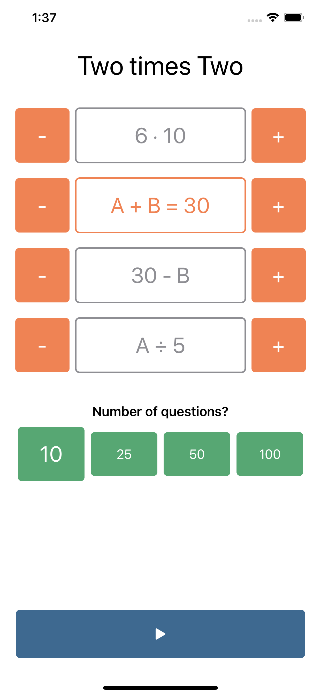
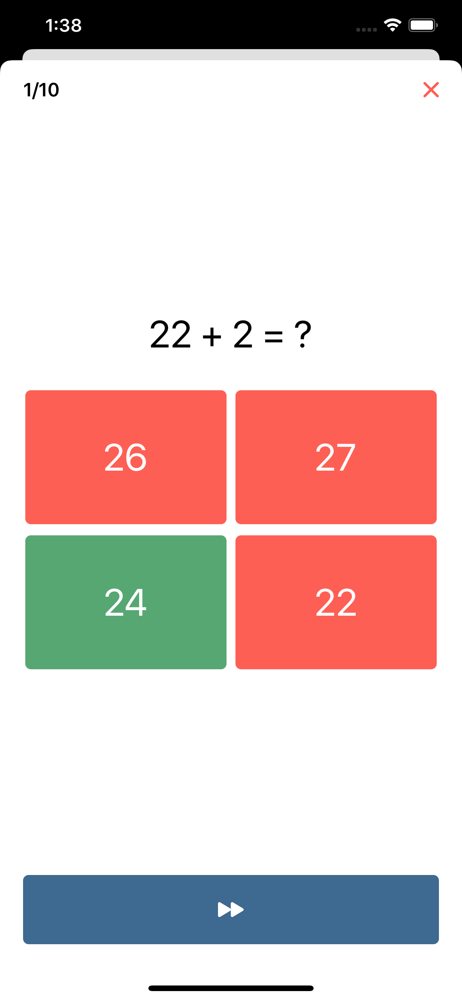

# Two times Two

The app is aiming to help kids to practice multiplication, addition, subtraction, and division.

## How to use

Select an exercice type and difficulty. Tap on start button. Practice.

